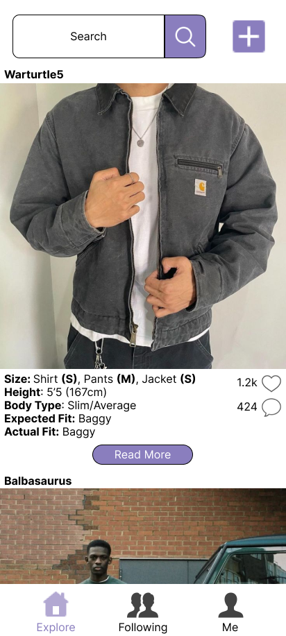
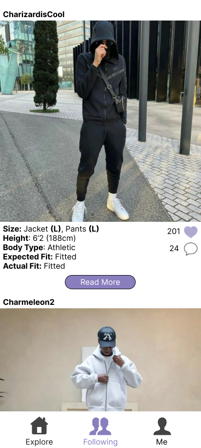
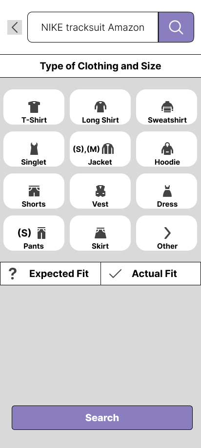
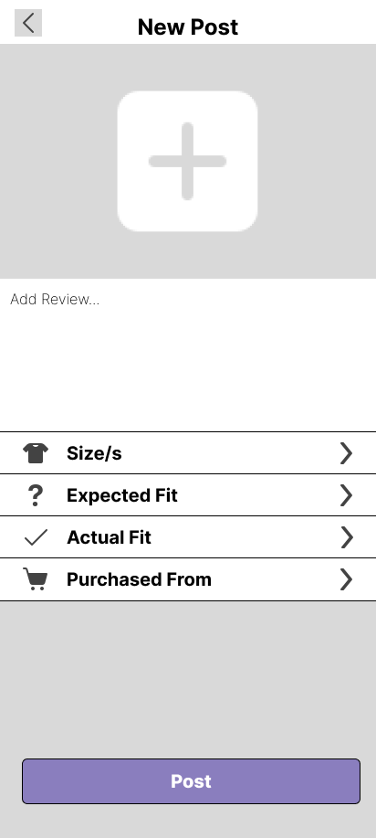
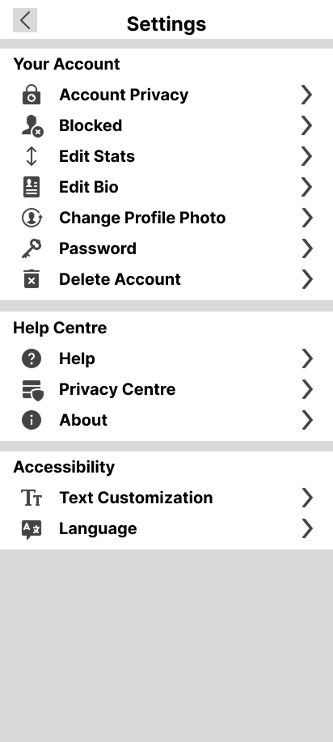

# FitView App Design

## Tagline
Your View to Your Perfect Fit!

## Description
FitView is a review app designed to transform online shopping for clothing. Users share their stats—such as size, height, and weight and then are able to provide detailed fit reviews with categorised filters about the fit such as "Baggy," "Tight," or "Just Right." Reviews will include photos to provide visual clarity and better guidance. The app empowers users to explore how clothing fits on individuals with similar body types, making more confident shopping decisions and reducing returns.

The app fosters a community-driven approach to shopping, where user-submitted insights create a reliable platform for discovering the perfect fit. By enabling users to actively search for reviews of clothing they are interested in, FitView combines authenticity and inclusivity to deliver a seamless shopping experience. Its commitment to reducing unnecessary returns and promoting informed choices makes it a valuable tool for anyone seeking to enhance their wardrobe without the guesswork.

## Main Features
- **User Authentication:**
    
Enable secure account creation, login, and personalised profiles with Firebase Authentication. Users can manage their accounts easily and enjoy a customised experience.

- **Remote Database Integration:**
    
Store user-submitted fit reviews and photos in a centralised, cloud-based database using Firebase Firestore. This ensures data is secure, accessible, and scalable.

- **Photo Uploads:**
    
Allow users to utilise their mobile device to upload photos alongside reviews. Visual comparisons enhance clarity and provide vital context for other users.

- **Fit Tags:**
    
Streamline browsing by categorising clothing fit into intuitive tags—such as "Super Baggy," "Baggy," "Tight," and "Just Right." These tags make it easy to find reviews that match individual preferences.

- **Expected vs. Actual Fit:**
    
Reviews will include both the expected fit (based on the product description or size chart) and the actual fit (as experienced by the user). This feature provides deeper insights into fit accuracy, helping users make better purchasing decisions. Customers can filter reviews by expected vs. actual fit to narrow their searches 

- **User Following:**
    
Build a sense of community by enabling users to follow others with similar stats or fashion interests. Stay updated on their posts for a personalised feed of relevant reviews.

- **Like System:**
    
Empower users to express their agreement with reviews by liking them. This helps highlight the most helpful and reliable reviews for the broader community.

- **Commenting on Reviews:**
    
Facilitate discussions and deeper insights by enabling users to comment on reviews. This feature fosters collaboration and allows users to ask for additional details.

- **Purchased From Information:**
    
Empower users to express their agreement with reviews by liking them. This helps highlight the most helpful and reliable reviews for the broader community. This information is also in app's search filters, allowing users to quickly find reviews for specific brands, retailers, or products. 

- **Search Filters for Clothing:**
    
Provide advanced search functionality, enabling users to filter reviews by fit tags (e.g., "Baggy," "Tight") and/or size. This feature ensures users can easily locate relevant reviews.

CHANGE TO WHAT ARE THE MAIN OPTIONS OF EACH SCREEN

## Target Users
### User Groups
- **Fashion Enthusiasts:**
    
These users are passionate about clothing, trends, and self-expression. They value being stylish and keeping up with the latest fashion but often face challenges in finding outfits that fit perfectly to their needs. FitView caters to their needs by helping them avoid sizing guesswork and build a wardrobe that complements their style.

- **Online Shoppers:** 
    
With the convenience of online shopping comes the uncertainty of finding the right fit. This group regularly purchases clothes online but struggles to interpret size charts and reviews that lack body-specific details. They seek a tool that simplifies their experience, allowing them to filter reviews and make informed choices without the frustration of misfitting purchases

- **Return-Weary Customers:**
    
These users are tired of the time and effort wasted on returning ill-fitting clothing. They prioritise reliability and are highly motivated by the promise of reducing unnecessary returns. FitView addresses this pain point by offering visual and descriptive fit reviews from users with similar body types, ensuring higher satisfaction with their purchases.

### User Personas
1. **Sophia, 25**
- **Profile:** A young professional and social media user with a passion for trendy clothing.
- **Goals:** Sophia wants to shop confidently online without worrying about inconsistent sizing across brands. She frequently buys outfits for events and everyday wear, relying on influencers and peer reviews for guidance.
- **Pain Points:** Often struggles with clothes that don’t fit her petite frame properly, leading to frustrating returns. She feels disconnected from generic reviews that don’t reflect her body type
- **How FitView Helps:** By browsing reviews written by users with similar stats, Sophia can visualise how an outfit will fit her. The photo uploads provide added clarity, while categorised filters streamline her search for on-trend pieces

2. **Tom, 32**
- **Profile:** A busy tech consultant who values the efficiency of online shopping for his wardrobe essentials.
- **Goals:** Tom wants practical, no-nonsense insights to help him find well-fitting clothes quickly. With a full schedule, he prefers to avoid time-consuming returns and exchanges.
- **Pain Points:** Frustrated by inconsistent sizing and vague product descriptions, Tom often hesitates to buy items he isn’t sure will fit. This reduces his overall satisfaction with online shopping.
- **How FitView Helps:** Through reliable reviews and fit comparisons, Tom can make confident decisions on his purchases. The app’s search functionality allows him to filter reviews by fit type and clothing category, saving him time and effort

3. **Jake, 17**
- **Profile:** A high school student who has worked hard to save up money for his favourite clothing brand’s latest release.
- **Goals:** Jake wants to ensure he purchases the right size on the first attempt since the item is highly sought after and may sell out if returned for exchange. He’s looking for dependable and relatable fit reviews that help him make a confident decision.
- **Pain Points:** Anxious about sizing charts that lack clear guidance and generic reviews that don’t reflect his specific needs. He can’t afford to make a mistake due to limited availability of the product and his financial constraints.
- **How FitView Helps:** Jake can search for reviews written by users with similar stats and view accompanying photos to gauge fit accuracy. The app’s focus on detailed insights and visual references ensures Jake gets the best fit without risking the loss of his hard-earned savings or missing out on his favourite item.

### Why Choose FitView?
FitView sets itself apart by providing detailed, user-driven fit reviews tailored to individual body types, allowing users to make more informed shopping decisions. Unlike generic platforms, FitView enables users to actively search for reviews based on clothing size and fit, making it easy to find relevant insights. By including visual references such as photos, the app offers a level of clarity and authenticity that helps users avoid the frustration of misfitting purchases.

FitView also fosters a sense of community by allowing users to follow others with similar stats, creating a network of relatable and reliable reviewers. This unique approach encourages honest insights and collaboration, making it an indispensable tool for shoppers who value transparency and convenience. With FitView, finding clothes that truly fit becomes a simpler and more confident process.

## Visual Design
The FitView app is structured around three main screens—Explore, Following, and Me—each offering a unique browsing experience. Additionally, there are three functional screens that provide essential features: Search, Post, and Settings. The overall design emphasises simplicity and usability, with most screens presented in a list format to ensure the information is digestible at a glance. Each post includes key details, such as the product sizes, user stats, expected fit, actual fit, photos, like and comment counts, and a "read more" section for extended reviews.

This cohesive design makes it easy for users to scroll through content, interact with posts, and access the app’s core functions efficiently. Below is a breakdown of each screen and its features:

#### Explore Screen

The Explore screen acts as the app’s main discovery page, showcasing a variety of posts in a continuous list format. At the top of the screen, users can access the Search and Post buttons, which redirect them to their respective functionalities. Below these, posts are displayed with all relevant details, such as reviewer stats, photos, expected and actual fit, and engagement metrics (likes and comments). This intuitive layout encourages users to keep scrolling until they find posts that resonate with them.

#### Following Screen

The Following screen is designed for a personalised experience, allowing users to view posts exclusively from the people they follow. Like the Explore screen, it adopts the same list format for consistency and ease of browsing. However, the Search and Post buttons are omitted to keep the focus solely on the reviews shared by followed users.

#### Me Screen

The Me screen offers users a view of their own activity and profile details. Unlike the previous two screens, this page adopts a grid view to display the user's posts visually and cohesively. In addition to the grid layout of reviews, the screen features the user’s profile information, including stats, bio, and follower count. For added functionality, the Settings and Post buttons are placed at the top-right corner, ensuring quick access to essential actions.

#### Search Screen

The Search screen allows users to locate specific products or reviews by pasting a product link, entering a brand name, or searching by clothing type. Results are displayed in a grid format, showcasing different clothing items and sizes. Additionally, users can apply filters for expected and actual fit to narrow down results that match their preferences. This advanced filtering system ensures users can find the most relevant reviews efficiently

#### Post Screen

The Post screen simplifies the process of creating a detailed review, guiding users through a step-by-step list layout. Starting from the top, users can upload a photo, enter an extended review, provide sizes, select expected and actual fit tags, and specify where the item was purchased. This structured design streamlines the workflow, making it easy for users to share high-quality, informative posts

#### Settings Screen

The Settings screen adopts a clear and organised list view, divided into three sections: User Account Settings, About, and Accessibility. This screen allows users to customise their app experience, modify account preferences, and adjust accessibility options such as text size and language. The straightforward layout ensures users can navigate and make changes effortlessly

## MVP Scope (Minimum Viable Product)

### Objective of the MVP:
The MVP will deliver the core features of FitView, ensuring users can create and explore detailed fit reviews seamlessly. These foundational features focus on addressing user needs, testing app engagement, and validating the app's concept before incorporating additional functionalities in future iterations.

### Core Features in MVP:
The MVP will include the following essential features:
- **User Authentication:** Secure account creation, login, and personalised profiles using Firebase Authentication.
- **Review Submission:** Users can create posts with photos, extended reviews, stats, and expected vs. actual fit tags
- **Photo Upload Feature:** Allow users to upload images of the products they are reviewing.
- **Fit Tags:** Categorised filters such as "Baggy," "Tight," and "Just Right" for easy browsing.
- **Search Filters:** Provide basic search functionality for clothing by fit and/or size.

### Deferred Features
The following features will be considered for future iterations but excluded from the MVP to focus on the app's essential functionality:
- **User Following System:** Building a community feature that allows users to follow others.
- **Trending Reviews Page:** Highlighting popular content based on likes and comments.
- **Advanced Search Filters:** Searching by "Purchased From" information and using product links.
- **Likes on Posts:** Allowing users to express their agreement with reviews by liking them.
- **Commenting on Reviews:** Enabling users to discuss or ask questions about reviews.
- **Accessibility Settings:** Providing options to customise text size, language, and app layout for improved accessibility.

### Goals for the MVP:
The primary goals of the MVP are:
- To provide users with a functional platform for submitting and exploring fit reviews.
- To test user engagement with key features like review submissions and basic search filters.
- To collect feedback from early adopters for enhancing user experience and refining deferred features.